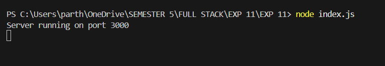
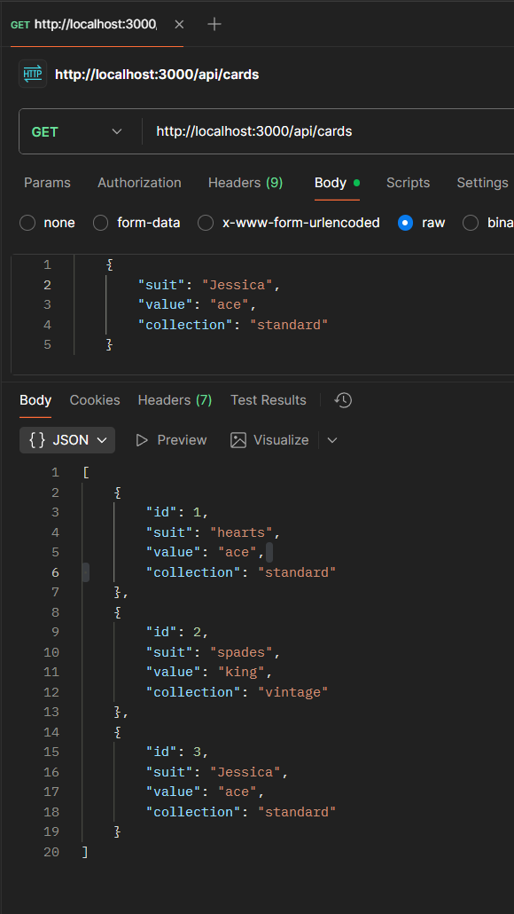
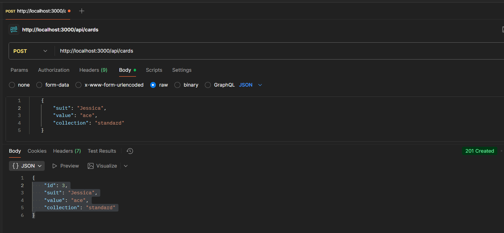

# REST API for Playing Card Collection Using Express.js

## Objective
Build a RESTful API using Express.js to manage a collection of playing cards. This project helps you understand routing, handling HTTP methods, and basic data manipulation in a Node.js backend environment.

## Features
- List all cards
- Add a new card (with properties like suit and value)
- Retrieve a specific card by ID
- Delete a card by ID
- Data is stored in an in-memory array for simplicity
- RESTful API with proper HTTP methods and JSON responses

## Prerequisites
- Node.js installed
- npm (Node Package Manager)

## Step 1: Execute index.js

## Step 2: Postman Screenshot

